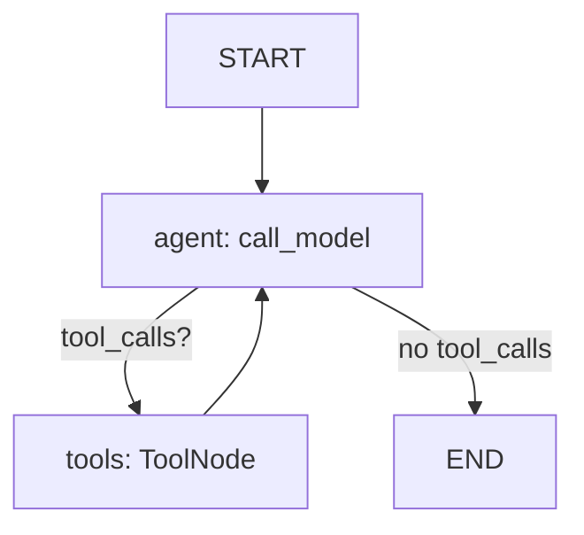

# Análisis Técnico Completo: OpenGravity

## Guía de Migración TypeScript → Python + LangChain + LangGraph

---

## 1. Visión General del Proyecto

**OpenGravity** es un agente de IA conversacional que opera a través de Telegram. Su propósito es permitir a **técnicos de campo** reportar avances de obra, consultar pendientes y registrar actividades de forma natural (texto o audio).

### Stack Actual (TypeScript / Node.js)

| Capa | Tecnología | Archivo(s) |
|:---|:---|:---|
| Entrypoint | `ts-node` | `src/index.ts` |
| Bot (Telegram) | `grammy` | `src/bot/telegram.ts` |
| Middlewares | `grammy` | `src/bot/middlewares/whitelist.ts`, `identity.ts` |
| Agent Loop | Manual (while) | `src/agent/loop.ts` |
| LLM Provider | Groq SDK (Llama 3.3 70B) + OpenRouter fallback | `src/llm/client.ts` |
| Transcripción Audio | Groq Whisper Large V3 | `src/llm/client.ts` |
| Memoria/Chat History | Firebase Firestore | `src/db/firebase.ts`, `src/db/schema.ts` |
| Datos de Negocio | PostgreSQL | `src/db/postgres.ts` |
| Herramientas del Agente | Registry pattern | `src/tools/registry.ts`, `*.ts` |
| Configuración | dotenv | `src/config/env.ts` |

---

## 2. Análisis Archivo por Archivo

### 2.1 `src/index.ts` — Punto de Entrada

```
main() {
  1. initializeDatabase()     → Conecta Firebase Firestore
  2. initializePostgres()     → Conecta PostgreSQL
  3. import tools (side-effect → auto-register)
  4. startBot()               → Inicia polling de Telegram
}
```

**Python equivalente**: Un `main.py` que inicialice el pool de Postgres, configure las tools y arranque el bot.

---

### 2.2 `src/config/env.ts` — Variables de Entorno

Variables requeridas:

| Variable | Uso |
|:---|:---|
| `TELEGRAM_BOT_TOKEN` | Token del bot de Telegram |
| `TELEGRAM_ALLOWED_USER_IDS` | Lista de IDs permitidos (whitelist), separados por coma |
| `GROQ_API_KEY` | API key de Groq (LLM principal) |
| `OPENROUTER_API_KEY` | Fallback LLM (opcional) |
| `OPENROUTER_MODEL` | Modelo de OpenRouter |
| `GOOGLE_APPLICATION_CREDENTIALS` | Service account JSON para Firebase |
| `POSTGRES_URL` | Connection string de PostgreSQL |

**Python equivalente**: `python-dotenv` + `pydantic-settings` o un simple `os.getenv()`.

---

### 2.3 `src/llm/client.ts` — Cliente LLM

**Lógica principal:**

1. **Provider primario**: Groq SDK con modelo `llama-3.3-70b-versatile`.
2. **Fallback**: Si Groq falla y existe `OPENROUTER_API_KEY`, reintenta con OpenRouter vía HTTP.
3. **Tool Calling**: Envuelve las definiciones de tools en formato `{ type: 'function', function: toolDef }` y usa `tool_choice: 'auto'`.
4. **Transcripción de Audio**: Usa `groq.audio.transcriptions.create()` con el modelo `whisper-large-v3`.

**Python equivalente:**

```python
from langchain_groq import ChatGroq

# LLM principal
llm = ChatGroq(
    model="llama-3.3-70b-versatile",
    api_key=os.getenv("GROQ_API_KEY"),
    temperature=0
)

# Bind de herramientas
llm_with_tools = llm.bind_tools(tools)

# Transcripción de audio (con Groq SDK directo)
from groq import Groq
groq_client = Groq(api_key=os.getenv("GROQ_API_KEY"))

def transcribe_audio(file_path: str) -> str:
    with open(file_path, "rb") as f:
        result = groq_client.audio.transcriptions.create(
            file=f, model="whisper-large-v3", response_format="text"
        )
    return result
```

---

### 2.4 `src/db/firebase.ts` + `src/db/schema.ts` — Memoria Conversacional

**Qué hace:**
- Inicializa Firebase Admin SDK con service account.
- Guarda cada mensaje (user, assistant, tool) en Firestore bajo `/users/{userId}/messages/`.
- Recupera los últimos N mensajes ordenados por timestamp.

**En Python con LangGraph esto se REEMPLAZA completamente:**

LangGraph tiene el concepto de **Checkpointer** que persiste automáticamente el estado completo del grafo (incluyendo todos los mensajes) por `thread_id`.

```python
from langgraph.checkpoint.postgres import PostgresSaver

# Usa la misma Postgres para todo
checkpointer = PostgresSaver.from_conn_string(os.getenv("POSTGRES_URL"))

# Al compilar el grafo:
graph = builder.compile(checkpointer=checkpointer)

# Al invocar: thread_id = telegram_id del usuario
config = {"configurable": {"thread_id": str(telegram_id)}}
result = graph.invoke({"messages": [HumanMessage(content=user_text)]}, config)
```

> **IMPORTANTE**: Con esto ya NO necesitas Firebase Firestore. La memoria queda en Postgres.

---

### 2.5 `src/db/postgres.ts` — Base de Datos de Negocio

**Funciones exportadas:**

| Función | Propósito |
|:---|:---|
| `initializePostgres()` | Crea pool de conexión con SSL condicional |
| `getPgPool()` | Devuelve el pool singleton |
| `findTelegramUser(telegramId)` | Busca en tabla `tecnicos_telegram` |
| `upsertTelegramUser(telegramId, nombre, username)` | UPSERT del usuario con ON CONFLICT |
| `linkPhoneToTelegramUser(telegramId, phone)` | Vincula teléfono → busca técnico → autoriza |

**Python equivalente**: `psycopg2` o `asyncpg`, o bien `SQLAlchemy` para ORM.

```python
import psycopg2
from psycopg2.extras import RealDictCursor

pool = psycopg2.pool.ThreadedConnectionPool(1, 10, dsn=os.getenv("POSTGRES_URL"))

def find_telegram_user(telegram_id: int):
    with pool.getconn() as conn:
        with conn.cursor(cursor_factory=RealDictCursor) as cur:
            cur.execute("SELECT * FROM tecnicos_telegram WHERE telegram_id = %s", (telegram_id,))
            return cur.fetchone()
```

---

### 2.6 `src/tools/registry.ts` — Registro de Herramientas

**Patrón actual:** Un `Map<string, Tool>` global con funciones `registerTool()`, `getToolDefinitions()` y `executeTool()`.

**En Python/LangChain esto se simplifica** usando el decorador `@tool`:

```python
from langchain_core.tools import tool

@tool
def get_current_time() -> dict:
    """Devuelve la fecha y hora actual."""
    from datetime import datetime
    now = datetime.now()
    return {"time": str(now.time()), "date": str(now.date()), "iso": now.isoformat()}
```

No necesitas un registry manual. LangChain maneja la serialización de schemas automáticamente.

---

### 2.7 Herramientas del Agente (Tools)

#### `get_current_time`
- **Parámetros**: Ninguno.
- **Retorna**: Hora, fecha, timezone, ISO.
- **Migración**: Trivial (ver ejemplo arriba).

#### `check_technician`
- **Parámetros**: `telegram_id: number`
- **Lógica**: Query a `tecnicos_telegram` JOIN `tecnicos` para verificar autorización.
- **Retorna**: `{isRegistered, autorizado, tecnico: {id, nombre, telefono}}`

```python
@tool
def check_technician(telegram_id: int) -> dict:
    """Verifica si el usuario de Telegram está registrado como técnico autorizado."""
    conn = pool.getconn()
    try:
        with conn.cursor(cursor_factory=RealDictCursor) as cur:
            cur.execute("""
                SELECT tt.telegram_id, tt.autorizado, tt.nombre, tt.telefono,
                       t.id as tecnico_id, t.nombre as nombre_tecnico
                FROM tecnicos_telegram tt
                LEFT JOIN tecnicos t ON t.id = tt.tecnico_id
                WHERE tt.telegram_id = %s
            """, (telegram_id,))
            row = cur.fetchone()
            if not row:
                return {"isRegistered": False, "message": "Usuario no encontrado."}
            if not row["autorizado"]:
                return {"isRegistered": True, "autorizado": False}
            return {"isRegistered": True, "autorizado": True, "tecnico": dict(row)}
    finally:
        pool.putconn(conn)
```

#### `check_construction_status`
- **Parámetros**: `keyword: string`
- **Lógica**: Busca obra por ILIKE, luego pendientes abiertos y últimos 5 reportes.

#### `create_tech_report`
- **Parámetros**: `telegram_id`, `obra_nombre`, `mensaje_original`, `actividades[]`, `nuevos_pendientes[]?`
- **Lógica (TRANSACCIONAL)**:
  1. Resolve `tecnico_id` desde `telegram_id`.
  2. Busca `obra_id` por ILIKE nombre.
  3. INSERT en `reportes`.
  4. INSERT múltiples en `actividades`.
  5. INSERT múltiples en `pendientes` (si existen).
  6. COMMIT o ROLLBACK.

> **CRÍTICO**: Esta herramienta usa transacciones. En Python, usar `with conn: ... conn.commit()` o `try/except + rollback`.

---

### 2.8 `src/bot/telegram.ts` — Bot de Telegram

**Pipeline de middlewares (orden importa):**

```
Mensaje entrante
    │
    ▼
[1] whitelistMiddleware → ¿ID en lista permitida? → Si no, DROP silencioso
    │
    ▼
[2] contact handler → Si es contacto compartido, vincula teléfono
    │
    ▼
[3] identityMiddleware → ¿Autorizado en DB? → Si no, pide compartir teléfono
    │
    ▼
[4] message:text → runAgentLoop(userId, text)
    │
    ▼
[5] message:voice/audio → transcribeAudio() → runAgentLoop(userId, transcribedText)
```

**Python equivalente (`python-telegram-bot` o `aiogram`):**

```python
from telegram import Update
from telegram.ext import ApplicationBuilder, MessageHandler, filters

async def handle_text(update: Update, context):
    telegram_id = update.effective_user.id
    text = update.message.text
    
    # Invocar el grafo de LangGraph
    config = {"configurable": {"thread_id": str(telegram_id)}}
    result = await graph.ainvoke(
        {"messages": [HumanMessage(content=text)], "telegram_id": telegram_id},
        config
    )
    
    reply = result["messages"][-1].content
    await update.message.reply_text(reply)
```

---

### 2.9 `src/bot/middlewares/whitelist.ts`
- Compara `ctx.from.id` contra `ENV.TELEGRAM_ALLOWED_USER_IDS[]`.
- Si no está, ignora silenciosamente.

### 2.10 `src/bot/middlewares/identity.ts`
- Llama a `upsertTelegramUser()` para crear/actualizar el registro.
- Si `autorizado == true` → pasa al agente.
- Si `autorizado == false` → envía teclado con botón "📱 Compartir mi número" y **bloquea** el request.

---

### 2.11 `src/agent/loop.ts` — El Corazón del Agente

**Flujo actual (bucle imperativo):**

```
runAgentLoop(userId, userInput):
  1. saveMessage(userId, 'user', userInput)           → Firestore
  2. history = getHistory(userId, 10)                  → Últimos 10 msgs
  3. messages = [systemPrompt(userId), ...history]
  4. for i in 0..MAX_ITERATIONS(5):
       response = chatCompletion(messages, tools)
       if response.tool_calls:
           for each tool_call:
               result = executeTool(name, args)
               messages.push(toolResult)
           continue  ← vuelve a llamar al LLM
       else:
           saveMessage(userId, 'assistant', response)
           return response.content                     ← FIN
  5. return "Error: max iterations"
```

**Equivalente en LangGraph (grafo con nodos y edges):**

```python
from langgraph.graph import StateGraph, START, END
from langgraph.prebuilt import ToolNode
from langchain_core.messages import SystemMessage, HumanMessage

# 1. Definir estado
class AgentState(TypedDict):
    messages: Annotated[list, add_messages]
    telegram_id: int

# 2. Nodo: llamar al modelo
def call_model(state: AgentState):
    system_msg = SystemMessage(content=build_system_prompt(state["telegram_id"]))
    messages = [system_msg] + state["messages"]
    response = llm_with_tools.invoke(messages)
    return {"messages": [response]}

# 3. Nodo: ejecutar herramientas
tool_node = ToolNode(tools=[get_current_time, check_technician, check_construction_status, create_tech_report])

# 4. Decidir si continuar o terminar
def should_continue(state: AgentState):
    last_message = state["messages"][-1]
    if last_message.tool_calls:
        return "tools"
    return END

# 5. Construir el grafo
builder = StateGraph(AgentState)
builder.add_node("agent", call_model)
builder.add_node("tools", tool_node)
builder.add_edge(START, "agent")
builder.add_conditional_edges("agent", should_continue, {"tools": "tools", END: END})
builder.add_edge("tools", "agent")

# 6. Compilar con checkpointer (memoria persistente)
graph = builder.compile(checkpointer=checkpointer)
```



---

## 3. Esquema de Base de Datos (PostgreSQL)

```
usuarios        → Usuarios del dashboard (admin/encargado)
tecnicos        → Técnicos de campo (nombre, teléfono)
tecnicos_telegram → Vinculación: telegram_id ↔ tecnico_id (autorización)
obras           → Proyectos/obras (nombre, estado, cliente)
reportes        → Cabecera: técnico + obra + mensaje original
actividades     → Detalle: líneas de trabajo (FK → reportes)
pendientes      → Tareas pendientes por obra (FK → obras)
fotos           → Imágenes adjuntas (FK → reportes)
```

> **Nota**: La tabla `tecnicos_telegram` fue agregada en una migración posterior (`DB_migration_fase5.sql`).

---

## 4. Estructura Propuesta para el Proyecto Python

```
opengravity-python/
├── .env
├── requirements.txt
├── main.py                    ← Entrypoint: init DB + init bot
├── config/
│   └── settings.py            ← Variables de entorno (pydantic-settings)
├── agent/
│   ├── graph.py               ← StateGraph de LangGraph
│   └── prompts.py             ← System prompt dinámico
├── tools/
│   ├── time_tool.py
│   ├── technician_tool.py
│   ├── construction_tool.py
│   └── report_tool.py
├── db/
│   ├── pool.py                ← Pool de conexión psycopg2/asyncpg
│   └── identity.py            ← upsert/find/linkPhone helpers
├── bot/
│   ├── telegram_bot.py        ← Handlers de texto, audio, contacto
│   └── middlewares.py         ← Whitelist + Identity check
└── llm/
    └── transcription.py       ← Whisper via Groq SDK
```

---

## 5. `requirements.txt` Sugerido

```txt
langchain>=0.3
langchain-groq>=0.2
langgraph>=0.2
psycopg2-binary>=2.9
python-telegram-bot>=21
python-dotenv>=1.0
groq>=0.11
```

---

## 6. Checklist de Migración

- [ ] Configurar entorno Python (`venv`, `.env`)
- [ ] Crear `config/settings.py` con todas las variables
- [ ] Crear `db/pool.py` con conexión a PostgreSQL
- [ ] Crear `db/identity.py` con `upsert_telegram_user`, `link_phone_to_telegram_user`
- [ ] Implementar `tools/` (4 herramientas con `@tool`)
- [ ] Implementar `agent/graph.py` con `StateGraph`
- [ ] Implementar `agent/prompts.py` con el system prompt dinámico
- [ ] Implementar `bot/telegram_bot.py` con handlers
- [ ] Implementar `bot/middlewares.py` (whitelist + identity)
- [ ] Implementar `llm/transcription.py` (Whisper)
- [ ] Configurar `PostgresSaver` como checkpointer (reemplaza Firebase)
- [ ] Probar flujo completo: texto → agente → tool call → respuesta
- [ ] Probar flujo de audio: voz → transcripción → agente → respuesta
- [ ] Probar registro: contacto → vincular teléfono → autorizar
